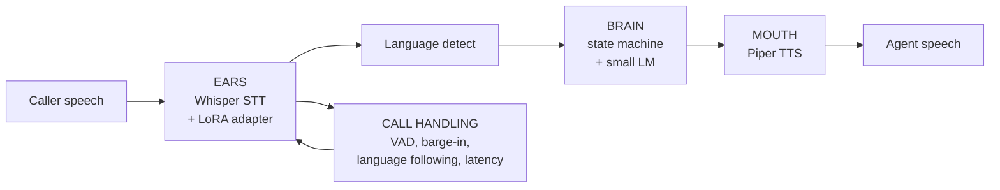

# Calling-Agent

I'm building a multilingual speech-to-speech phone-call agent for a business. It
listens to a caller, understands them, and replies out loud in the caller's own
language — following the caller when they switch languages mid-call. The priority
is Urdu and English (including natural Urdu-English mixed speech), then Hindi.

I chose a **chained pipeline** rather than one end-to-end model, because each
stage can be measured, improved and swapped independently:



## Status: work in progress

This is a working prototype, not a product. The pipeline runs end to end and is
tested, but it is not yet fast or accurate enough for real calls. See
[Known limitations](#known-limitations) and the honest numbers below.

## Supported languages

| Language | Status | Notes |
|---|---|---|
| English | Working | STT and TTS both functional. Only language with a dev set so far. |
| Urdu | Working (TTS weak) | STT and TTS functional; TTS voice is weak (see TTS_NOTES.md). Urdu-English mixed speech is the priority. |
| Hindi | Skeleton | TTS voice is poor (DEMO-ONLY). No dev data yet. Needs a better voice + native-speaker test. |

Spanish was removed in session 2; the project is now English/Urdu/Hindi only.

## Quick start

```bash
py -m venv .venv
.venv\Scripts\python.exe -m pip install -r requirements.txt
.venv\Scripts\python.exe scripts\check_env.py
```

## Run the agent

```bash
# text mode (no mic needed)
.venv\Scripts\python.exe -m src.pipeline text

# file mode (audio in, audio out)
.venv\Scripts\python.exe -m src.pipeline file -i path\to\audio.wav

# mic mode (live, with barge-in)
.venv\Scripts\python.exe -m src.pipeline mic

# web demo (localhost only)
.venv\Scripts\python.exe scripts\web_demo.py
```

## Record a test set (optional, for evaluation)

```bash
.venv\Scripts\python.exe scripts\record_testset.py
```

One sentence at a time; Enter to record, `r` to redo, `s` to skip. Saves 16 kHz
mono WAV to `data/testset_audio/` + a row in `data/metadata.csv`. This set is
**never used for training** — it only measures the model. See RECORDING_GUIDE.md.

## Run the baseline (STT WER)

```bash
.venv\Scripts\python.exe scripts\baseline.py --metadata data/devset_metadata.csv
```

## Train (overnight LoRA loop)

```bash
.venv\Scripts\python.exe engine.py smoke              # tiny run to prove the loop
.venv\Scripts\python.exe engine.py night --hours 4    # time-budgeted LoRA rounds
```

The loop trains in time-budgeted rounds, evaluates WER after each round, keeps
the best checkpoint, rolls back if worse, and logs to `results/train_log.csv`.
Re-run the same command to resume. Create a file named `STOP` in the project
root to stop gracefully.

## Tests

```bash
.venv\Scripts\python.exe -m pytest tests/ -v
```

## Results (only real measured numbers)

| Metric | Value | How measured |
|---|---|---|
| English STT WER (public dev set) | 0.0905 | `baseline.py`, whisper-tiny, CPU, 20 clips |
| Brain latency | 0.1 ms mean | `benchmark.py`, 50 turns |
| TTS latency (warm) | 1.3 s/sentence | Piper, CPU |
| End-to-end latency | 42–62 s | CPU; STT is the bottleneck |
| Peak RAM | 601 MB | STT + TTS + brain loaded |
| Peak VRAM | 0 MB | CPU-only torch (MX330 unused) |
| Simulated-call pass rate | 263/263 (100%) | `test_brain.py` bulk simulation |
| Unit tests | 36 passed | eval + brain + ingest + packs |

Everything not listed here is **TBD** — I have not measured it, and I won't guess.

## Responsible use

- **The agent says it is an AI.** Its greeting states that it is an AI assistant
  and that the call may be recorded. It never claims to be human; if asked, it
  says it is an AI and offers a human handoff.
- **Call recording.** The greeting notifies the caller that the call may be
  recorded. Do not deploy this without complying with local recording laws.
- **Knowledge boundary.** The agent answers only from the business knowledge
  file (`scenarios/*.yaml`). It never invents facts, prices or promises; if
  unsure, it offers a human handoff.
- **Licenses.** Every model, voice and dataset is recorded in LICENSES.md.
  Components marked DEMO-ONLY (e.g. the Hindi TTS voice) must not be used in a
  commercial product without replacement.

## Known limitations

- **CPU STT is too slow** for a ~1.5 s response target (42–62 s end to end). The
  fix is GPU STT; the MX330 (2 GB) is currently unused because I installed a
  CPU-only torch to stay under the download budget.
- **Urdu and Hindi TTS voices are weak** (round-trip WER 0.78 / 1.00). Hindi is
  DEMO-ONLY until a better voice is found.
- **No user test set yet.** The only labelled data is a small public English dev
  set (a stand-in, clearly labelled — not my test set). Urdu/Hindi WER is unmeasured.
- **No real phone lines.** The agent runs over mic/file/web, not a phone network.
- **The optional LLM path is untested at runtime.** The rule-based brain is the
  tested default; the LLM is wired in but off by default (RAM).

## Roadmap

1. **GPU STT** — install CUDA torch, move STT to the MX330, cut end-to-end latency.
2. **Real test set** — record Urdu/English/Hindi clips, verify the prompts, get
   per-language WER.
3. **Better TTS** — find stronger Urdu/Hindi voices, run native-speaker listening tests.
4. **Language packs** — train per-language LoRA adapters, wire the release gate.
5. **More scenarios** — prove the business data is swappable (restaurant scenario
   already added).
6. **Phone integration** — connect a real phone line (future phase).

## Layout

```
configs/train.yaml      training config
scenarios/              business knowledge (clinic.yaml, restaurant.yaml)
src/                    eval, brain, pipeline, tts, packs
engine.py               overnight LoRA training loop
scripts/                baseline, record_testset, benchmark, tts_check, web_demo,
                        ingest_links, release_gate, extract_devset
packs/                  per-language packs (english, urdu, hindi)
data/                   dev set + prompts (audio git-ignored)
results/                eval/benchmark outputs (regenerable, git-ignored)
```

## License

See [LICENSES.md](LICENSES.md) for every model, voice and dataset and its license.
